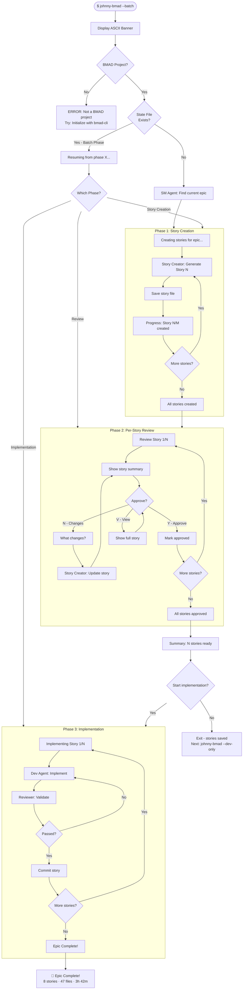
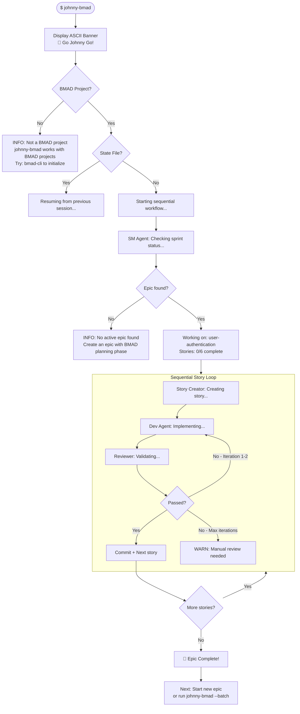
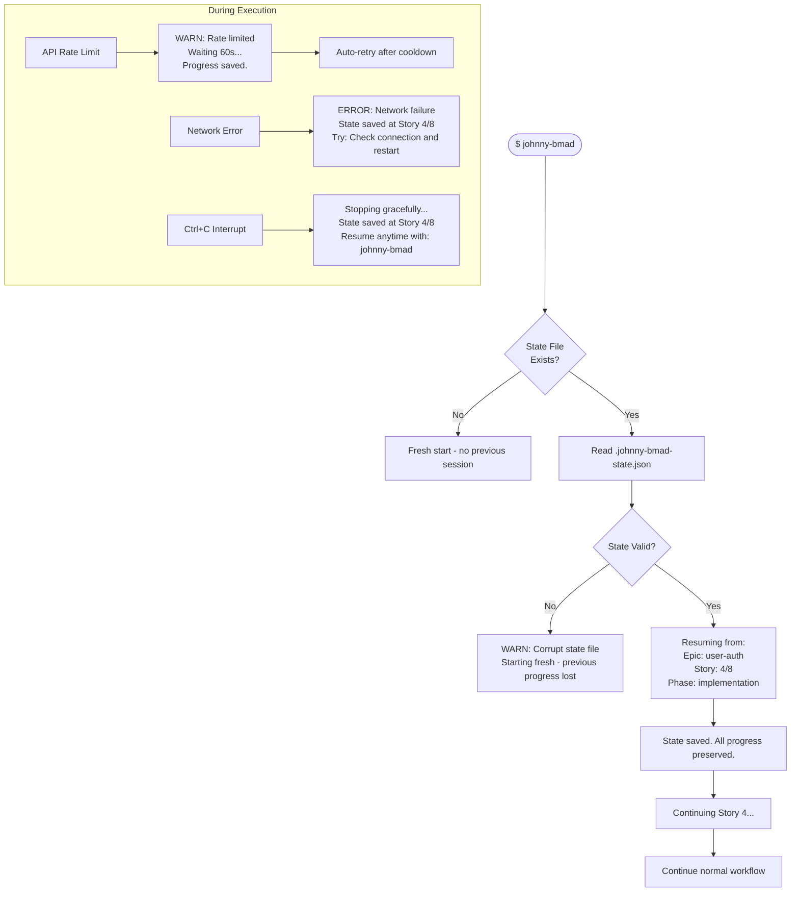

# UX Design Specification - johnny-bmad

**Author:** J
**Date:** 2026-02-02

---

## Executive Summary

### Project Vision

johnny-bmad transforms the BMAD implementation experience from manual toil to automated orchestration. The v1 batch workflow enhancement enables **time arbitrage** - developers can plan their next epic while the current one implements automatically through coordinated multi-agent execution.

The core UX promise: **"Review the plan once, trust the automation completely."**

### Target Users

**Primary: Marcel (Corporate Developer)**
- Senior developer at enterprise, complex codebases, human peer review required
- Needs: Review complete story set BEFORE committing to 8+ hour implementation
- Success moment: "I validated the plan, kicked off automation, and worked on the next feature while it ran"

**Secondary: Alex (Solo Developer)**
- Freelance/indie developer, uses BMAD for side projects
- Needs: Simple installation, zero-config first run, clear progress visibility
- Success moment: "I just ran the command and watched it implement my entire epic"

**Tertiary: Sam (Reliability-Focused Developer)**
- Runs long sessions, concerned about crashes and lost work
- Needs: Automatic resume, clear recovery feedback, confidence in reliability
- Success moment: "It crashed at hour 5, I restarted, and it picked up exactly where it left off"

### Key Design Challenges

1. **Long-Running Session Experience** - 8+ hours unattended requires confidence-building feedback patterns and clear "return to desk" status communication
2. **Multi-Phase State Communication** - Batch workflow phases (create → review → implement) must be instantly legible at any moment
3. **Error Recovery UX** - API failures and network issues need actionable recovery guidance, not cryptic errors
4. **Per-Story Review Flow** - Reviewing 8+ stories must be efficient, with clear approve/change mechanics
5. **Mode Confusion Prevention** - Sequential vs Batch vs Dev-Only modes must be clearly differentiated before user commits

### Design Opportunities

1. **Narrative Progress Output** - Transform terminal logs into a story of agent collaboration and epic completion
2. **Resume Experience Excellence** - Best-in-class feedback that instantly restores user confidence after interruption
3. **Zero-Config Onboarding** - First run that converts skeptics to believers through clear, magical progress
4. **Help as Documentation** - `--help` output that teaches workflows, not just lists flags
5. **Batch Plan Review Moment** - The key UX moment where Marcel reviews all stories before implementation - make it feel like signing off on a solid plan

## Core User Experience

### Defining Experience

johnny-bmad's core experience is **autonomous orchestration with human oversight at critical moments**. The fundamental interaction loop:

1. **Invoke** - Run command with chosen mode (sequential, batch, dev-only)
2. **Observe** - Watch multi-agent coordination progress through terminal output
3. **Approve** - Confirm stories (batch mode) or commits (sequential mode)
4. **Trust** - Walk away knowing automation handles implementation
5. **Return** - Come back to completed, reviewed, committed work

The core action to get right: **The batch story review and approval moment** - this is where users decide to trust 8+ hours of autonomous execution.

### Platform Strategy

| Aspect | Decision |
|--------|----------|
| **Platform** | Terminal/CLI (cross-platform Node.js) |
| **Input Mode** | Keyboard - command flags, y/n prompts, text input |
| **Output Mode** | Colored terminal text (chalk), progress indicators |
| **Connectivity** | Requires Claude API - no offline mode |
| **Session Duration** | Designed for 8+ hour unattended runs |
| **State Persistence** | `.johnny-bmad-state.json` for automatic resume |

### Effortless Interactions

These interactions must require zero friction or thought:

1. **Starting a session** - `johnny-bmad` with no required flags
2. **Resuming after interruption** - Automatic on restart, no --resume flag needed
3. **Understanding current state** - Glanceable output showing epic, story, phase
4. **Approving good work** - Single keystroke confirmation
5. **Exiting cleanly** - Ctrl+C saves state, resumes gracefully later

### Critical Success Moments

| Moment | Success Indicator | Failure Mode |
|--------|-------------------|--------------|
| **First Run** | User sees agents working within 10 seconds | Confusing errors, unclear what's happening |
| **Batch Review** | User confidently approves story set | User unsure if stories are complete/correct |
| **Long Session Return** | Clear summary of what completed | Wall of scrolled-past logs with no summary |
| **Crash Recovery** | "Resuming from Story 4/8" message | Silent restart from beginning |
| **Epic Complete** | Celebration message with stats | Quiet exit with no summary |

### Experience Principles

1. **Trust Through Transparency** - Users always know: current phase, active agent, story progress, what happens next
2. **Effortless Start, Confident Resume** - Zero-config entry, automatic state recovery, no lost work ever
3. **Plan Once, Trust Completely** - Batch approval is the contract; automation honors it without surprises
4. **Errors Guide, Not Block** - Failures include: what failed, why, exact recovery steps
5. **Progress as Narrative** - Output tells a story of collaborative agent work, not a debug log

## Desired Emotional Response

### Primary Emotional Goals

| Emotion | Description | Success Indicator |
|---------|-------------|-------------------|
| **Confidence** | Users know exactly what's happening and trust the automation | User walks away from 8-hour session without checking back |
| **Empowerment** | Users feel 10x more productive through time arbitrage | User starts planning next epic while current one implements |
| **Relief** | Liberation from tedious manual implementation toil | User expresses "finally, I don't have to do this myself" |
| **Control** | Human-in-the-loop dignity - automation follows user decisions | User feels they approved the plan, not that AI decided for them |

### Emotional Journey Mapping

| Stage | Target Emotion | Design Response |
|-------|----------------|-----------------|
| **Discovery** | Hopeful excitement | Clear value proposition in --help, compelling first output |
| **First Run** | Surprised delight | Agents visibly working within 10 seconds, clear progress |
| **Story Review (Batch)** | Confident approval | Well-structured story display, easy approve/change mechanics |
| **Walking Away** | Calm trust | Reassuring messaging: "Running autonomously. Progress saved continuously." |
| **Return to Desk** | Instant clarity | Completion summary with stats, clear next steps |
| **Error/Crash** | Reassured relief | "All progress saved. Resuming from Story 4/8, Phase: implementation" |
| **Epic Complete** | Pride + accomplishment | Celebration moment: "Epic complete! 8 stories, 47 files changed, 3h 42m" |

### Micro-Emotions

**Target States:**
- Confidence over confusion (always know current state)
- Trust over skepticism (first run converts doubters)
- Relief over anxiety (state always saved, resume always works)
- Accomplishment over frustration (clear success feedback)
- Control over helplessness (human approval at key moments)

**Emotions to Avoid:**
- Confusion: "What's happening? Which agent? What story?"
- Anxiety: "Did it crash? Is my work lost?"
- Helplessness: "I can't stop it or change the plan"
- Frustration: "It failed and I don't know why or how to fix it"
- Distrust: "I don't believe this will actually work"

### Design Implications

| Emotional Goal | UX Design Approach |
|----------------|-------------------|
| **Build Confidence** | Persistent status line showing: mode, phase, agent, story X/Y |
| **Create Trust** | First-run experience must be flawless - agents working within 10 seconds |
| **Provide Relief** | Every output reinforces: "State saved. Resume anytime." |
| **Enable Control** | Clear approval gates, ability to request story changes in batch mode |
| **Celebrate Success** | Epic completion includes: story count, files changed, time elapsed, commit hashes |

### Emotional Design Principles

1. **Transparency Builds Trust** - Never leave users wondering what's happening; constant visibility into agent activity and progress
2. **Reassurance Over Silence** - During long operations, periodic "still working" signals prevent anxiety
3. **Recovery Messaging Matters** - Error messages must immediately address "is my work safe?" before explaining what went wrong
4. **Celebrate Completions** - Don't just exit quietly; acknowledge accomplishments with meaningful stats
5. **First Impressions Convert** - The skeptic-to-believer conversion happens in the first 60 seconds; optimize ruthlessly for this moment

## UX Pattern Analysis & Inspiration

### Inspiring Products Analysis

**gh cli (GitHub CLI)**
- Context-aware prompts that know your repo and suggest smart defaults
- Interactive flows that guide users through complex operations
- Actionable error messages with exact recovery commands
- Clean, professional output formatting

**Claude Code**
- Streaming output showing work in progress
- Clear tool/agent visibility ("Reading file...", "Writing...")
- Permission prompts before significant actions
- Transparent about what it's doing and why

**Bun**
- Speed-focused messaging ("Done in 42ms")
- Minimal output on success - celebrates without clutter
- Clean, modern aesthetic
- Specific, actionable error messages

**npm**
- Visual progress bars for long operations
- Audit warnings surfaced inline
- Clear script execution context

**Homebrew**
- Celebration moments with emoji (🍺)
- Post-action guidance ("To start, run...")
- Clear phase transitions during install
- Update notifications

### Transferable UX Patterns

**Navigation & Flow Patterns:**
- Context-aware defaults (auto-detect BMAD project, suggest current epic)
- Interactive guided flows for complex operations (batch story review)
- Clear phase transitions with visual markers

**Feedback Patterns:**
- Real-time agent activity visibility ("SM Agent checking sprint status...")
- Progress indicators with story counts ("Story 4/8")
- Speed/timing feedback for completed operations
- Celebration moments at key milestones

**Error Patterns:**
- Actionable recovery commands in every error
- "Try: [exact command]" format
- Address "is my work safe?" before explaining what failed

**Output Patterns:**
- Minimal default output, verbose opt-in for real-time debugging
- **Always write full logs to file** regardless of verbosity mode
- Clean aesthetics - professional, not cluttered
- Important information visually distinct (color, spacing)
- Post-session auditability: "Full session log: .johnny-bmad-logs/session-{timestamp}.log"

### Anti-Patterns to Avoid

| Anti-Pattern | Why Avoid | johnny-bmad Response |
|--------------|-----------|---------------------|
| Wall of text in default mode | Users can't find important info | Reserve verbose for --verbose, but always log to file |
| Silent failures | User doesn't know something went wrong | Always surface errors clearly |
| Cryptic error messages | Users can't recover without searching | Include exact recovery steps |
| No progress indication | User thinks it's frozen during long ops | Always show activity for ops >2s |
| Buried important info | Key messages lost in noise | Visual hierarchy with color/spacing |
| No audit trail | Can't debug issues after the fact | Always persist full logs to file |

### Design Inspiration Strategy

**Adopt Directly:**
- gh cli's actionable error format: "Try: [command]"
- Homebrew's celebration moments with emoji
- Claude Code's agent activity visibility
- Bun's minimal success output philosophy
- CI/CD log file patterns: Always persist full logs for post-hoc debugging

**Adapt for johnny-bmad:**
- npm's progress bars → Story progress with "Story 4/8 [████░░░░]"
- gh cli's interactive mode → Batch story review flow
- Homebrew's post-install guidance → "Next: run johnny-bmad --dev-only"

**Avoid:**
- Default verbose output (make it opt-in, but always log to file)
- Silent phase transitions
- Generic "An error occurred" messages
- Celebration without substance (show real stats)
- Unauditable sessions (always have log files available)

## Design System Foundation

### Design System Choice

**Approach: Structured + Expressive CLI Hybrid**

johnny-bmad adopts a CLI design system that balances professional clarity with personality at key moments. The system prioritizes readability during long sessions while celebrating accomplishments meaningfully.

**Design Philosophy:** "Clean by default, expressive when it matters"

### Rationale for Selection

| Factor | Decision Driver |
|--------|-----------------|
| **8+ hour sessions** | Output must not be fatiguing - minimal default, verbose opt-in |
| **Multi-agent visibility** | Need clear distinction between SM, Story Creator, Dev, Reviewer |
| **Cross-platform** | Colors must work on macOS, Linux, Windows terminals |
| **Existing stack** | Leverage chalk (colors) and inquirer (prompts) already in codebase |
| **Developer audience** | Professional aesthetic that feels trustworthy for enterprise use |

### Implementation Approach

**Color Palette:**

| Color | Usage | chalk Function |
|-------|-------|----------------|
| 🟢 Green | Success, completion, approval, "safe" messages | `chalk.green()` |
| 🔵 Blue/Cyan | Info, agent activity, progress indicators | `chalk.cyan()`, `chalk.blue()` |
| 🟡 Yellow | Warnings, prompts requiring user input | `chalk.yellow()` |
| 🔴 Red | Errors (with reassuring recovery guidance) | `chalk.red()` |
| ⚪ White/Gray | Standard output, details, secondary info | `chalk.white()`, `chalk.gray()` |
| 🟣 Magenta | Highlights, special moments | `chalk.magenta()` |

**Agent Color Coding:**

| Agent | Color | Label Format |
|-------|-------|--------------|
| SM Agent | Cyan | `[SM]` |
| Story Creator | Blue | `[Story]` |
| Dev Agent | Green | `[Dev]` |
| Reviewer | Magenta | `[Review]` |

**Message Patterns:**

| Message Type | Format Example |
|--------------|----------------|
| **Phase Transition** | `━━━ Phase: Story Creation ━━━` |
| **Agent Start** | `[SM] Checking sprint status...` |
| **Progress** | `Story 4/8 [████████░░░░░░░░] implementing...` |
| **Success** | `✓ Story STORY-001 implemented successfully` |
| **Error** | `✗ API Error: Rate limited. Try: wait 60s and restart` |
| **Celebration** | `🎉 Epic Complete! 8 stories · 47 files · 3h 42m` |

### Customization Strategy

**Output Verbosity Levels:**

| Level | Flag | Output Style |
|-------|------|--------------|
| **Default** | (none) | Clean narrative - phase transitions, story progress, completions |
| **Verbose** | `--verbose` | Full detail - all agent output, timestamps, debug info |
| **Quiet** | (future) | Minimal - only errors and final summary |

**Visual Elements:**

| Element | Default Mode | Verbose Mode |
|---------|--------------|--------------|
| Agent labels | `[SM]` | `[SM 14:32:05]` |
| Progress bars | `[████░░░░]` | Percentage + ETA |
| Phase markers | `━━━ Phase ━━━` | Full separator lines |
| Timestamps | Hidden | Shown on every line |

**Consistent Spacing:**
- Blank line before phase transitions
- No blank lines between related messages
- Section headers with consistent separator style
- Indentation for sub-operations (2 spaces)

**Log File Format:**
- Always include timestamps
- Include full agent output regardless of verbosity
- Structured for grep/search: `[TIMESTAMP] [AGENT] [LEVEL] message`
- Location: `.johnny-bmad-logs/session-{YYYY-MM-DD-HHmmss}.log`

## Detailed User Experience

### Defining Experience

**"Review the plan, approve it, trust the automation"**

johnny-bmad's defining experience is the **confident approval moment** - when users review a complete story set, validate the plan, and commit to hours of autonomous execution with trust.

This moment transforms johnny-bmad from "another automation tool" into "my trusted implementation partner."

**The Marcel Moment:**
The primary user (Marcel, corporate developer) experiences this as: "I see all 8 stories, I've validated each one, I trust this plan. Now I can walk away and work on the next feature while this implements automatically."

### User Mental Model

**How users currently solve this:**
- Manually implement stories one-by-one
- Constant context-switching between planning and coding
- Fear of wrong direction discovered hours into implementation

**Mental model they bring:**
- Approval workflows (like PR reviews, contract signing)
- "Review before commit" patterns from version control
- Quality gates before deployment

**Expectation:**
"Show me the complete plan upfront. Let me validate it. Then automate the tedious parts."

**Familiar metaphor:**
Like approving a detailed PR before merge - except the "merge" is 8 hours of implementation.

### Success Criteria

| Criteria | Measurable Target |
|----------|-------------------|
| **Clarity** | User understands each story in <30 seconds |
| **Confidence** | User approves without lingering doubts |
| **Control** | User can modify any story before proceeding |
| **Speed** | Review 8 stories in 15-20 minutes |
| **Trust** | User walks away without checking back for hours |

**User says "this just works" when:**
- Stories are detailed enough to implement without questions
- Acceptance criteria are clear and complete
- No surprises emerge during implementation
- The plan they approved is the plan that executes

### Novel UX Patterns

**Established patterns we leverage:**
- Per-item review flow (familiar from PR approvals)
- y/n confirmation prompts (CLI standard)
- Progress indicators (story X/Y)
- Color-coded status (green = approved)

**Novel combination:**
- **Batch creation → Sequential review → Bulk execution**
- This workflow doesn't exist in other tools
- Creates a "trust contract" between human and automation

**The innovation:**
johnny-bmad's defining experience combines familiar CLI patterns into a novel workflow that establishes a trust contract: "You approved this plan. The automation will execute exactly what you approved."

### Experience Mechanics

**Phase 1: Initiation**
```
$ johnny-bmad --batch
━━━ Batch Mode: Story Creation ━━━
Creating stories for Epic: user-authentication...
```

**Phase 2: Story Creation + Review Loop**
```
[Story] Creating STORY-001: Implement login form...
✓ Story created

━━━ Review Story 1/8 ━━━
Title: Implement login form with validation
Tasks: 4 subtasks | Acceptance Criteria: 5 items

[Y] Approve  [N] Request changes  [V] View full story
```

**Phase 3: Change Request Flow (if needed)**
```
> n
What changes are needed? > Add network error handling

[Story] Updating STORY-001...
✓ Story updated - please review again

━━━ Review Story 1/8 (revised) ━━━
```

**Phase 4: Completion**
```
━━━ Batch Complete ━━━
✓ All 8 stories created and approved

Ready for implementation:
  1. STORY-001: Implement login form ✓
  2. STORY-002: Add session management ✓
  ...

Next: johnny-bmad --dev-only
```

**Key UX decisions:**
- One story at a time (not overwhelming list)
- Immediate review after creation (fresh context)
- Change request inline (no separate editing step)
- Clear "what's next" guidance at completion

## Visual Design Foundation

### CLI Visual Elements

**Status Symbols (Text-Based):**

| Status | Symbol | Usage |
|--------|--------|-------|
| Success | `[OK]` | Story completed, approval confirmed |
| Failure | `[FAIL]` | Review failed, implementation error |
| Warning | `[WARN]` | Non-blocking issues, retrying |
| Info | `[INFO]` | Status updates, agent activity |
| Error | `[ERROR]` | Blocking issues requiring action |

**Progress Indicators:**

| Element | Style | Example |
|---------|-------|---------|
| Progress Bar | Block fill | `[████░░░░]` |
| Story Count | Fraction | `Story 4/8` |
| Combined | Both | `Story 4/8 [████░░░░] implementing...` |

**Visual Separators:**

| Context | Style | Example |
|---------|-------|---------|
| Phase Transition | Box drawing | `━━━ Phase: Implementation ━━━` |
| Section Header | Dashes | `--- Story Review ---` |
| Subsection | None | Indentation only |

**Emoji Policy:**

| Context | Usage |
|---------|-------|
| Epic Completion | 🎉 celebration allowed |
| All Other Output | No emoji - professional text only |

**Unicode Characters:**

| Element | Character | Fallback |
|---------|-----------|----------|
| Progress filled | `█` | `#` |
| Progress empty | `░` | `-` |
| Separator | `━` | `=` |

### Typography (Terminal)

**Output Structure:**
- Agent labels: `[AGENT]` in brackets, colored
- Messages: Standard terminal font
- Emphasis: Color only (no bold/italic in default mode)
- Verbose mode: Timestamps prepended

**Line Length:**
- Target: 80 characters max for primary messages
- Allow overflow for file paths and technical details
- Wrap user-facing messages for readability

### Spacing & Layout

**Vertical Spacing:**
- Blank line before phase transitions
- No blank line between agent output lines
- Blank line after completion summaries

**Horizontal Spacing:**
- Agent labels: Fixed width `[SM]    ` for alignment
- Indentation: 2 spaces for sub-items
- Progress bars: Right-aligned percentage when shown

### Accessibility Considerations

**Color Independence:**
- All status conveyed by text label, not just color
- `[OK]` not just green, `[FAIL]` not just red
- Works on monochrome terminals

**Terminal Compatibility:**
- ASCII fallbacks for all Unicode characters
- Respect `NO_COLOR` environment variable
- Test on: macOS Terminal, iTerm, Windows Terminal, Linux terminals

## Design Direction Decision

### Chosen Direction: Narrative + Professional Hybrid

johnny-bmad adopts the **Narrative + Professional Hybrid** direction - combining a bold, memorable brand moment with clean, professional execution throughout the tool.

### Brand Identity: The Banner

```
     ██╗ ██████╗ ██╗  ██╗███╗   ██╗███╗   ██╗██╗   ██╗
     ██║██╔═══██╗██║  ██║████╗  ██║████╗  ██║╚██╗ ██╔╝
     ██║██║   ██║███████║██╔██╗ ██║██╔██╗ ██║ ╚████╔╝
██   ██║██║   ██║██╔══██║██║╚██╗██║██║╚██╗██║  ╚██╔╝
╚█████╔╝╚██████╔╝██║  ██║██║ ╚████║██║ ╚████║   ██║
 ╚════╝  ╚═════╝ ╚═╝  ╚═╝╚═╝  ╚═══╝╚═╝  ╚═══╝   ╚═╝
                    ╔╗ ╔╦╗╔═╗╔╦╗
                    ╠╩╗║║║╠═╣ ║║  🎸 Go Johnny Go!
                    ╚═╝╩ ╩╩ ╩═╩╝
```

### Design Rationale

| Aspect | Decision |
|--------|----------|
| **Banner** | Bold ASCII art with Chuck Berry "Go Johnny Go!" tagline - creates memorable brand identity |
| **After Banner** | Clean, professional output - the tool speaks through its quality, not its personality |
| **When Shown** | Session start only (not on --help or errors) |
| **Celebration** | 🎉 emoji reserved for epic completion - earned, not casual |

### Implementation Approach

**The Hybrid Formula:**
1. **Brand moment** (banner) establishes personality at session start
2. **Professional execution** throughout the workflow builds trust
3. **Celebration moment** (epic complete) rewards accomplishment
4. **Minimal personality elsewhere** - let the work speak for itself

**Why This Works:**
- Chuck Berry reference honors the name's origin authentically
- ASCII art banner is distinctive without being gimmicky
- Professional body output suits enterprise developers (Marcel)
- Single tagline ("Go Johnny Go!") is memorable without being annoying
- Celebration at completion creates positive final impression

**Banner Display Rules:**
- Show on fresh session start
- Don't show on resume (jump straight to "Resuming from...")
- Don't show on --help (keep help clean and functional)
- Don't show on error exits

## User Journey Flows

### Journey 1: Batch Workflow (Marcel's Primary Flow)

**Entry Point:** Developer runs `johnny-bmad --batch` in BMAD project directory



**Key Flow Decisions:**
- Resume routing based on saved phase in state file
- Per-story review prevents batch review fatigue
- Change requests loop back to same story (don't skip ahead)
- Implementation can be deferred with `--dev-only` later

### Journey 2: First-Run Discovery (Alex's Zero-Config Flow)

**Entry Point:** Developer runs `johnny-bmad` with no flags in BMAD project



**Key Flow Decisions:**
- No flags = sequential mode (backwards compatible)
- Banner creates memorable first impression
- Clear feedback on what's happening at each step
- Converts skeptics through visible agent activity

### Journey 3: Resume & Recovery (Sam's Error Recovery Flow)

**Entry Point:** Developer restarts after crash, network error, or intentional stop



**Key Flow Decisions:**
- No special `--resume` flag needed - automatic
- Immediate reassurance: "All progress preserved"
- Show exactly where resuming from
- Graceful Ctrl+C handling with state save

### Journey Patterns

**Navigation Patterns:**
- **Auto-detection**: BMAD project detection without explicit config
- **Mode inference**: No flags = sequential, `--batch` = batch workflow
- **Resume routing**: State file determines entry point into workflow

**Decision Patterns:**
- **Y/N/V prompts**: Approve, Request changes, View full details
- **Continue/Exit gates**: Option to defer implementation after review
- **Retry limits**: Max iterations before escalating to manual review

**Feedback Patterns:**
- **Agent visibility**: `[SM]`, `[Story]`, `[Dev]`, `[Review]` labels
- **Progress indicators**: `Story 4/8 [████░░░░]`
- **Phase transitions**: `━━━ Phase: Implementation ━━━`
- **Reassurance messaging**: "State saved. Progress preserved."

### Flow Optimization Principles

| Principle | Implementation |
|-----------|----------------|
| **Minimize steps to value** | First agent activity visible within 10 seconds |
| **Reduce cognitive load** | One story review at a time, not overwhelming list |
| **Clear progress indicators** | Always show X/Y story progress |
| **Moments of delight** | Banner at start, 🎉 at epic complete |
| **Graceful error recovery** | All errors include exact recovery steps |
| **Trust through transparency** | Always show current agent, current story, current phase |

## Component Strategy

### Design System Components

**Foundation Layer (chalk + inquirer):**

johnny-bmad builds on the existing CLI stack already in the codebase:

| Library | Purpose | Components Provided |
|---------|---------|---------------------|
| **chalk** | Text styling | Colors, bold, dim, underline |
| **inquirer** | User prompts | Confirm, input, list, checkbox |

These provide the primitives; johnny-bmad defines custom output patterns on top.

### Custom Components

#### 1. ASCII Banner

**Purpose:** Create memorable brand impression at session start
**Usage:** Display once on fresh session start only

```
     ██╗ ██████╗ ██╗  ██╗███╗   ██╗███╗   ██╗██╗   ██╗
     ██║██╔═══██╗██║  ██║████╗  ██║████╗  ██║╚██╗ ██╔╝
     ██║██║   ██║███████║██╔██╗ ██║██╔██╗ ██║ ╚████╔╝
██   ██║██║   ██║██╔══██║██║╚██╗██║██║╚██╗██║  ╚██╔╝
╚█████╔╝╚██████╔╝██║  ██║██║ ╚████║██║ ╚████║   ██║
 ╚════╝  ╚═════╝ ╚═╝  ╚═╝╚═╝  ╚═══╝╚═╝  ╚═══╝   ╚═╝
                    ╔╗ ╔╦╗╔═╗╔╦╗
                    ╠╩╗║║║╠═╣ ║║  🎸 Go Johnny Go!
                    ╚═╝╩ ╩╩ ╩═╩╝
```

**States:** Single state - cyan color
**Rules:** Not shown on resume, --help, or error exits

#### 2. Phase Transition Header

**Purpose:** Clearly delineate workflow phases
**Format:** `━━━ Phase: {phase_name} ━━━`
**States:** Story Creation (blue), Review (yellow), Implementation (green)
**Spacing:** Blank line before, no blank line after

#### 3. Agent Activity Line

**Purpose:** Show which agent is working and what it's doing
**Format:** `[{agent}] {action}...`

| Agent | Label | Color |
|-------|-------|-------|
| SM Agent | `[SM]` | Cyan |
| Story Creator | `[Story]` | Blue |
| Dev Agent | `[Dev]` | Green |
| Reviewer | `[Review]` | Magenta |

**Verbose mode:** Adds timestamp `[SM 14:32:05] Checking sprint status...`

#### 4. Progress Bar

**Purpose:** Show story completion progress within epic
**Format:** `Story {n}/{total} [{bar}] {status}...`
**Example:** `Story 4/8 [████░░░░] implementing...`
**Characters:** `█` (filled), `░` (empty)
**Fallback:** `#` and `-` for terminals without Unicode

#### 5. Story Review Card

**Purpose:** Display story summary for batch review approval
**Format:**
```
━━━ Review Story {n}/{total} ━━━
Title: {story_title}
Tasks: {task_count} subtasks | Acceptance Criteria: {ac_count} items

[Y] Approve  [N] Request changes  [V] View full story
```
**Revised state:** `━━━ Review Story {n}/{total} (revised) ━━━`

#### 6. Status Message

**Purpose:** Convey operation outcomes clearly
**Format:** `[{STATUS}] {message}`

| Status | Color | Usage |
|--------|-------|-------|
| `[OK]` | Green | Success, completion |
| `[FAIL]` | Red | Review failed, error |
| `[WARN]` | Yellow | Non-blocking issue |
| `[INFO]` | Cyan | Status update |
| `[ERROR]` | Red + Bold | Blocking issue |

#### 7. Resume Message

**Purpose:** Restore user confidence after interruption
**Format:**
```
Resuming from:
  Epic: {epic_name}
  Story: {n}/{total}
  Phase: {phase}

State saved. All progress preserved.
```
**Color:** Green for reassurance

#### 8. Celebration Block

**Purpose:** Reward accomplishment at epic completion
**Format:** `🎉 Epic Complete! {story_count} stories · {file_count} files · {duration}`
**Color:** Magenta/bold
**Emoji:** Single 🎉 - earned celebration

#### 9. Error Block

**Purpose:** Guide recovery from failures
**Format:**
```
[ERROR] {error_type}: {error_message}
        State saved at Story {n}/{total}
        Try: {recovery_command}
```
**Rule:** Always include actionable "Try:" guidance

### Component Implementation Strategy

**File Organization:**
```
src/ui/
├── banner.ts        # ASCII banner display
├── phase-header.ts  # Phase transition headers
├── agent-line.ts    # Agent activity formatting
├── progress.ts      # Progress bar rendering
├── story-card.ts    # Story review card
├── status.ts        # Status message formatting
├── celebration.ts   # Epic completion block
└── index.ts         # Unified exports
```

**Implementation Principles:**
- All components respect `NO_COLOR` environment variable
- ASCII fallbacks for all Unicode characters
- Consistent spacing rules across all components
- Log file format: `[TIMESTAMP] [AGENT] [LEVEL] message`

### Implementation Roadmap

**Phase 1 - Core Components (MVP):**
- Status Message - needed for all feedback
- Agent Activity Line - needed for transparency
- Progress Bar - needed for long sessions
- Phase Transition Header - needed for batch workflow

**Phase 2 - Batch Workflow Components:**
- Story Review Card - needed for batch review flow
- Resume Message - needed for reliability UX
- Error Block - needed for recovery guidance

**Phase 3 - Polish Components:**
- ASCII Banner - brand identity at session start
- Celebration Block - epic completion reward

## UX Consistency Patterns

### Command & Flag Patterns

**Flag Naming Convention:**

| Pattern | Example | Rationale |
|---------|---------|-----------|
| Full flag | `--batch` | Clear, readable, self-documenting |
| Short flag | `-b` | Quick for experienced users |
| Boolean flags | `--verbose` | No value needed, presence = true |
| Value flags | `--max-iterations 3` | Space-separated value |

**Mode Selection Pattern:**
```
johnny-bmad              # Default: sequential mode
johnny-bmad --batch      # Batch workflow: create → review → implement
johnny-bmad --dev-only   # Implementation only: run through existing stories
```

**Flag Combination Rules:**
- `--batch` and `--dev-only` are mutually exclusive
- `--verbose` can combine with any mode
- `--yolo` (auto-approve) can combine with `--batch`

### Feedback Patterns

**Status Hierarchy:**

| Level | Format | Color | When Used |
|-------|--------|-------|-----------|
| Success | `[OK] message` | Green | Operation completed successfully |
| Info | `[INFO] message` | Cyan | Status updates, progress |
| Warning | `[WARN] message` | Yellow | Non-blocking issues, retrying |
| Error | `[ERROR] message` | Red | Blocking issues |
| Failure | `[FAIL] message` | Red | Review/validation failed |

**Progress Pattern:**
- Always show progress for operations >2 seconds
- Format: `Story 4/8 [████░░░░] implementing...`
- Update in place when possible (single line)

**Phase Transition Pattern:**
- Visual separator before new phase
- Blank line, separator, phase name
- Format: `━━━ Phase: {phase_name} ━━━`

### Prompt Patterns

**Confirmation Prompt (Y/N):**
```
Continue with implementation? [Y/n]
```
- Default option capitalized (Y = default yes)
- Lowercase for non-default (n)

**Approval Prompt (Y/N/V):**
```
[Y] Approve  [N] Request changes  [V] View full story
```
- Clear action labels
- Keyboard shortcuts in brackets
- Default: Y (approve)

**Text Input Prompt:**
```
What changes are needed? > _
```
- Clear question
- `>` prompt indicator

**Choice List Prompt:**
```
Select epic to work on:
  1. user-authentication (6 stories)
  2. payment-integration (4 stories)
> _
```
- Numbered options with helpful context

### Error Handling Patterns

**Error Message Structure:**
```
[ERROR] {error_type}: {brief_description}
        {additional_context}
        Try: {recovery_command}
```

**Error Categories:**

| Category | Example | Recovery Guidance |
|----------|---------|-------------------|
| Not BMAD project | "Not a BMAD project directory" | `Try: bmad-cli init` |
| No epic found | "No active epic found" | `Try: Create epic with BMAD planning` |
| API error | "Claude API rate limited" | `Try: Wait 60s and restart` |
| Network error | "Network connection failed" | `Try: Check connection and restart` |
| State error | "Corrupt state file" | `Try: Remove .johnny-bmad-state.json` |

**Error Recovery Pattern:**
- Always save state before surfacing error
- Always include "Try:" with specific action
- Never leave user without next step

### Help & Documentation Patterns

**Help Output Structure:**
```
Usage: johnny-bmad [options]

Automate BMAD implementation through multi-agent orchestration.

Options:
  --batch        Create all stories first, then review, then implement
  --dev-only     Skip story creation, implement existing stories
  --verbose      Show detailed agent output
  --yolo         Auto-approve all stories (use with --batch)
  --max-iterations <n>  Max dev/review cycles (default: 3)
  -h, --help     Show this help

Examples:
  johnny-bmad              Start sequential workflow
  johnny-bmad --batch      Create and review stories before implementing
  johnny-bmad --dev-only   Implement existing stories

Documentation: https://github.com/webeleon/johnny-bmad
```

### State Communication Patterns

**Session Start Pattern:**
```
[Banner]
Working on: user-authentication
Stories: 2/8 complete
Mode: batch (review phase)
```

**Resume Pattern:**
```
Resuming from:
  Epic: user-authentication
  Story: 4/8
  Phase: implementation

State saved. All progress preserved.
```

**Completion Pattern:**
```
🎉 Epic Complete!
   8 stories · 47 files · 3h 42m

Next: Start new epic or run johnny-bmad --batch
```

### Pattern Integration Summary

| User Need | Pattern Applied |
|-----------|-----------------|
| "What mode am I in?" | Session start shows mode |
| "What's happening now?" | Agent activity line |
| "How far along am I?" | Progress bar |
| "Did it work?" | Status messages |
| "Something broke!" | Error block with recovery |
| "How do I use this?" | Help output |
| "Can I stop and resume?" | Resume messaging |

## Terminal Adaptation & Accessibility

### Terminal Width Handling

| Terminal Width | Adaptation |
|----------------|------------|
| **< 60 chars** | Compact mode: truncate long paths, shorter messages |
| **60-80 chars** | Standard mode: full messages, wrapped appropriately |
| **> 80 chars** | Wide mode: progress bars can expand, more detail inline |

**Width-Adaptive Elements:**
- Progress bars scale with terminal width
- Long file paths truncated with `...` in narrow terminals
- Story titles wrapped or truncated based on available space

### Color & Styling Strategy

**NO_COLOR Environment Variable:**
```bash
export NO_COLOR=1
johnny-bmad  # Runs without any color output
```

**Color Fallback Hierarchy:**
1. If `NO_COLOR` set → Plain text only
2. If terminal doesn't support 256 colors → Basic 8 colors
3. If full color support → Use defined color palette

**Color-Independent Status:**
- Every status has text label: `[OK]`, `[FAIL]`, `[WARN]`
- Color enhances but is never required
- Works fully on monochrome displays

### Accessibility Strategy

**Accessibility Principles (WCAG Adapted for CLI):**

| Principle | CLI Adaptation |
|-----------|----------------|
| **Perceivable** | Text-based status, no color-only information |
| **Operable** | Keyboard-only operation (inherent to CLI) |
| **Understandable** | Clear error messages with recovery steps |
| **Robust** | Works across terminal emulators |

**Screen Reader Compatibility:**
- All output is plain text (inherently screen-reader friendly)
- No animations that break screen readers
- Progress updates on new lines when screen reader detected

**Color Blindness Support:**

| Condition | Accommodation |
|-----------|---------------|
| Red-green blindness | `[OK]`/`[FAIL]` text labels, not just colors |
| Blue-yellow blindness | Avoid relying on blue vs yellow alone |
| Complete color blindness | All info conveyed via text |

### Unicode Fallback Strategy

| Unicode | ASCII Fallback | Usage |
|---------|----------------|-------|
| `█` | `#` | Progress bar filled |
| `░` | `-` | Progress bar empty |
| `━` | `=` | Separators |
| `🎉` | `*` | Celebration |
| `🎸` | `>` | Banner tagline |

### Testing Strategy

**Terminal Compatibility Matrix:**

| Environment | Test Focus |
|-------------|------------|
| macOS Terminal | Default behavior |
| iTerm2 | Power user features |
| Windows Terminal | Windows default |
| Windows CMD | Legacy support |
| VS Code terminal | IDE integration |
| SSH sessions | Remote development |

**Accessibility Testing:**
- Run with `NO_COLOR=1` to verify text-only readability
- Test with VoiceOver (macOS) and NVDA (Windows)
- Verify all information conveyed without color
- Test with narrow terminal width (60 chars)

### Implementation Guidelines

**Key Principles:**
1. Color enhances, never required
2. Text conveys all meaning
3. Graceful degradation for limited terminals
4. Respect `NO_COLOR` environment variable
5. Provide ASCII fallbacks for all Unicode characters
